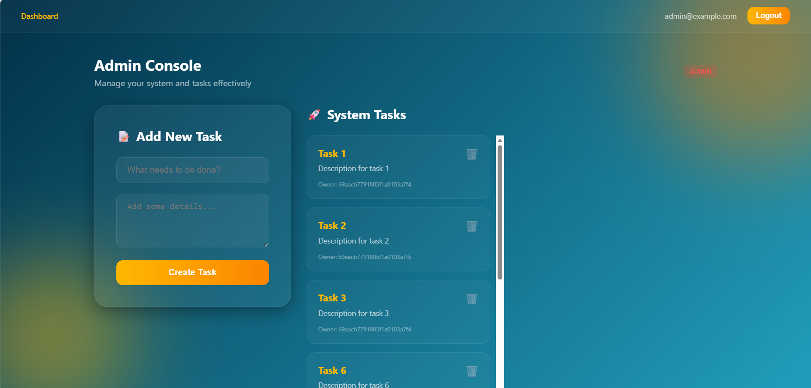
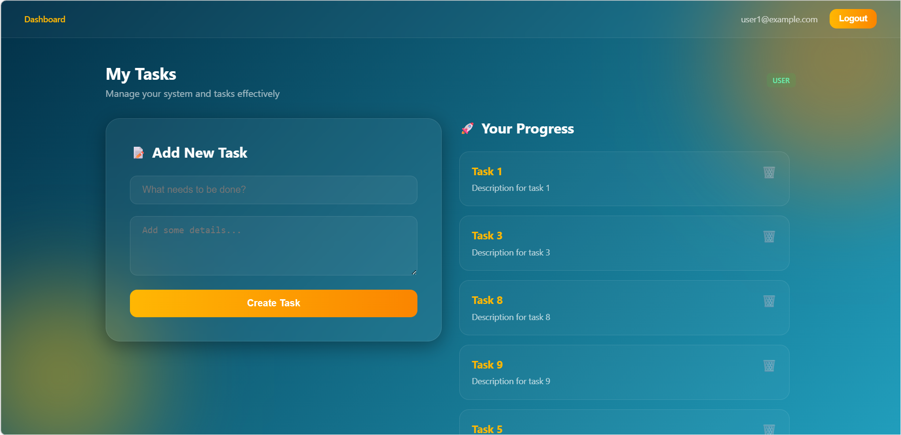
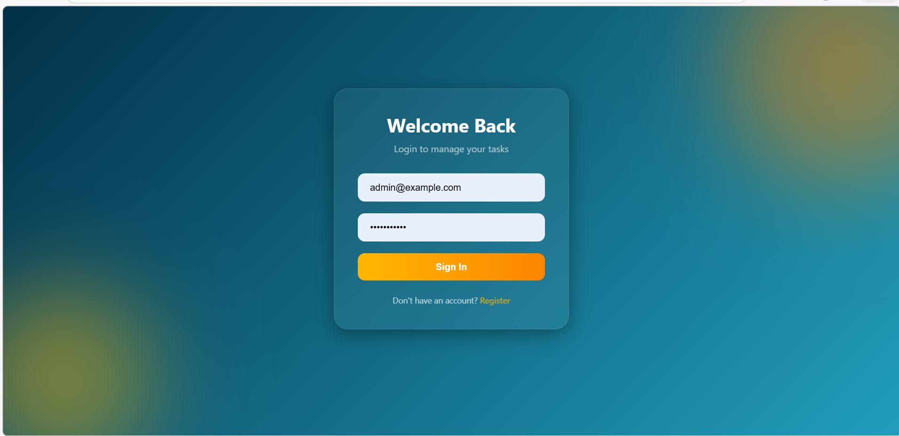
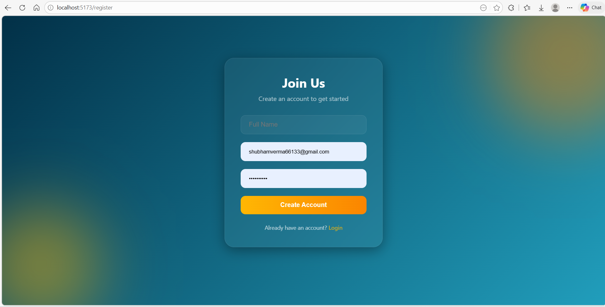

# Task Manager API & Glassmorphism UI (MongoDB Refactor)

This project is a high-performance Node.js Express backend and React frontend, refactored from PostgreSQL/Prisma to MongoDB/Mongoose. It features a modern, responsive Glassmorphism UI.

## 🚀 How to Test the Project

To see the role-based differences in the dashboard, please use the following seeded credentials:

### 1. Admin Login (Full Access)
- **Email**: `admin@example.com`
- **Password**: `password123`
- **What to expect**: 
  - You will see the **Admin Console**.
  - Access to two columns: **System Tasks** (all tasks in the DB) and **System Users** (list of all users).
  - Ability to delete any task or any user from the system.



### 2. Regular User Login (Personal Access)
- **Email**: `user1@example.com`
- **Password**: `password123`
- **What to expect**:
  - You will see the **User Dashboard**.
  - Simplified view showing only your own tasks.
  - No access to the user management list.



---

## 📸 Screenshots

| Login Page | Register Page |
|------------|---------------|
|  |  |

---

## 🛠️ Features
- **JWT Authentication**: Secure user sessions using JSON Web Tokens.
- **Task CRUD APIs**: Full Create, Read, Update, and Delete operations for tasks.
- **MongoDB Database**: Flexible schema design using Mongoose ODM.
- **Swagger API Docs**: Interactive API documentation and testing interface.
- **Docker Setup**: Containerized environment for consistent deployment.
- **Modern UI**: Full Glassmorphism theme with responsive design.

## 📖 API Documentation
Once the server is running, you can access the interactive Swagger UI at:
[http://localhost:4002/api-docs](http://localhost:4002/api-docs)

A **Postman Collection** is also included in the repository: [Task_Manager_API.json](Task_Manager_API.json). You can import this file into Postman to test the APIs.

## ⚙️ Installation

1. **Clone the repository**:
   ```bash
   git clone https://github.com/vermaji99/ScalableRESTAPIwithAuthentication-Role-Based-Access.git
   cd task-asap
   ```

2. **Install Dependencies**:
   ```bash
   # Root (Backend)
   npm install
   
   # Frontend
   cd apps/web
   npm install
   cd ../..
   ```

3. **Run the Project**:
   ```bash
   # Start Backend (on port 4002)
   npm run dev
   
   # Start Frontend (on port 5173)
   cd apps/web
   npm run dev
   ```

## 🔑 Environment Variables

Create a `.env` file in the root directory:
```env
PORT=4002
MONGO_URI=mongodb://localhost:27017/taskmanager
JWT_ACCESS_SECRET=your_secret_key_at_least_32_chars
```

## 🛣️ API Endpoints

### Auth
- `POST /api/v1/auth/register` - Register a new user
- `POST /api/v1/auth/login` - Login and receive JWT

### Tasks
- `GET /api/v1/tasks` - List tasks (Admin sees all, User sees own)
- `POST /api/v1/tasks` - Create a new task
- `PATCH /api/v1/tasks/:id` - Update a task
- `DELETE /api/v1/tasks/:id` - Delete a task

## 📐 Scalability Note

This project can scale using:
- **Load Balancers**: Distribute traffic across multiple API instances.
- **Microservices architecture**: Separate Auth and Task services for independent scaling.
- **Redis caching**: Cache frequently accessed data to improve performance.
- **Docker containerization**: Simplify deployment and scaling using Kubernetes.
- **Web3 Integration**: Extendable architecture to support crypto trading analytics services.

## 📁 Folder Structure
- `src/controllers`: Request handlers
- `src/models`: Mongoose models and validation schemas
- `src/services`: Core business logic
- `apps/web`: React frontend with Glassmorphism UI
- `src/utils/seed.js`: Database seeding script for easy evaluation
- `logs/`: Application log files
